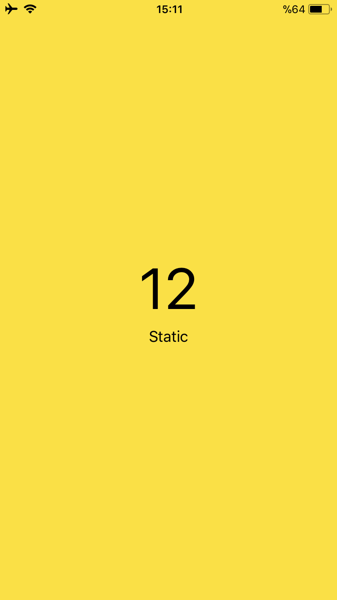

# Pedestrian Status
Pedestrian Status is a step detection app for the iPhone written with Swift.

It merely depends on the accelerometer to analyse it's users acceleration and convert it into steps taken.

## Description
Pedestrian Status mainly uses the step detection algorithm acquired from [this research](http://ieeexplore.ieee.org/xpl/articleDetails.jsp?arnumber=5507251)([PDF via RG](https://www.researchgate.net/publication/224154935_Accelerometer_Assisted_Robust_Wireless_Signal_Positioning_Based_on_a_Hidden_Markov_Model)).

The algorithm provided in the above research categorises the user's acceleration into three statuses: static, slow walking or fast walking. From there on, once the category is known, it can be concluded that:
- if slow walking, then count as one step,
- if fast walking, then count as two steps.

## Shortcomings
It’s well known that Pedestrian status is not without it’s flaws. Currently, the iPhone running Pedestrian Status should be hold at the a little above than the waistline level and parallel to the floor. e.g.:

Also sharply moving the hand will result in additionally detected steps as it will be detected as acceleration enough to be classified as a step.

Pedestrian Status is a proof-of-concept. Therefore such shortcomings as explained above are present. In a possible future version, it may overcome those shortcomings and provide a much better step detection.

## Usage
Just download the project and run it on an iPhone.

Since neither the project is not configured nor the algorithm is not tested to run on an iPad, such a scenario's results are currently unknown and left for the curious one's to test. 😏

## Requirements
- Xcode 9 beta 1 or higher
- Swift 4.0
- ARC

## Future Work
- data recording
- threshold training on-the-go
- unnecessary hand movement recognition
